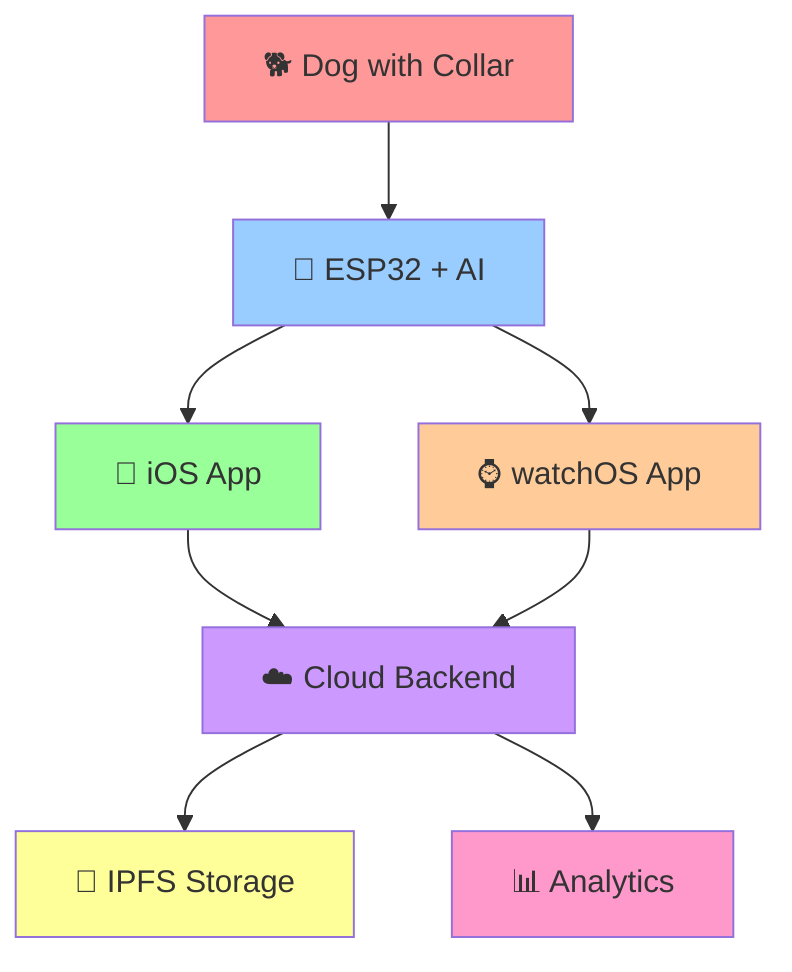

# 🐕‍🦺 PuppyThoth Alpha 🧠✨

> **"Bond Beyond Words"** - The Future of Human-Canine Communication

[](https://github.com/M-K-World-Wide/PuppyThoth/stargazers)
[](https://github.com/M-K-World-Wide/PuppyThoth/network/members)
[](https://github.com/M-K-World-Wide/PuppyThoth/issues)
[](https://github.com/M-K-World-Wide/PuppyThoth/blob/main/LICENSE)

---

## 🌟 What is PuppyThoth Alpha?

**PuppyThoth Alpha** is a revolutionary AI-powered canine companion system that creates a **quantum leap** in human-dog bonding through real-time emotion detection, voice synthesis, and encrypted cloud logging. 

Imagine understanding your dog's emotions and needs instantly, with a collar that speaks back to you! 🎤🐕

### 🎯 Core Features

- 🧠 **Real-time Emotion Detection** - AI-powered emotion classification
- 🎤 **Voice Synthesis** - Your dog "speaks" through the collar
- 📱 **Companion Apps** - iOS & watchOS integration
- 🔋 **Energy Harvesting** - Piezoelectric + Solar power system
- 🔐 **Encrypted Cloud** - IPFS-based tamper-proof logging
- 🚀 **Edge AI** - TensorFlow Lite on ESP32 microcontroller

---

## 🏗️ System Architecture



---

## 🔋 Hardware Components

### 💰 **Total Cost: $276.85**

| Category | Components | Cost |
|----------|------------|------|
| 🔋 **Power System** | Piezoelectric + Solar + Supercapacitor | $112.35 |
| 🎤 **Sensors** | MEMS mics, accelerometer, heart rate, temp | $78.90 |
| 📡 **Output** | Speaker, bone conduction, LED ring, haptic | $37.45 |
| 🧠 **Processing** | ESP32, flash memory, BLE module | $17.40 |
| 🔧 **Mechanical** | Enclosure, neck pad, mounting hardware | $30.75 |

### ⚡ **Power Analysis**
- **Peak Power**: ~1.48W
- **Energy Harvesting**: 3-8W under typical conditions
- **Battery Life**: 8-12 hours with energy harvesting
- **Supercapacitor**: 30-60 seconds at peak load

---

## 📱 Mobile App Design

### 🎨 **Design Philosophy**
**"Bond Beyond Words"** - Emotion-driven interface that enhances human-canine connection

### 📱 **iOS App Features**
- 🏠 **Home Dashboard** - Real-time emotion display
- 🎤 **Voice Commands** - Animated waveform visualization
- 📊 **Health Analytics** - Vital signs and emotion trends
- 🔔 **Smart Alerts** - Context-aware notifications

### ⌚ **watchOS App Features**
- ⚡ **Quick Actions** - One-tap commands
- 💓 **Health Monitor** - Heart rate and activity tracking
- 🎯 **Voice Commands** - Haptic feedback recording

---

## 🧠 AI/ML Architecture

### 🎭 **Emotion Classification (5 classes)**
- 😊 **JOY** - Happy, excited, playful
- 😌 **CALM** - Relaxed, content, peaceful
- 😰 **ANXIETY** - Nervous, worried, stressed
- 👀 **ALERT** - Attentive, focused, watchful
- 🎉 **EXCITEMENT** - Energetic, enthusiastic, eager

### 🎯 **Intent Classification (8 classes)**
- 👋 **ATTENTION_SEEK** - Wants owner's attention
- 🎾 **PLAY_REQUEST** - Wants to play
- 🍖 **FOOD_REQUEST** - Hungry or wants treats
- 🚽 **POTTY_NEED** - Needs to go outside
- ⚠️ **DANGER_ALERT** - Perceives threat or danger
- 🤗 **COMFORT_NEED** - Needs comfort or reassurance
- 🏃 **EXERCISE_NEED** - Needs physical activity
- 😴 **REST_NEED** - Tired or wants to rest

### 📊 **Performance Targets**
- 🎯 **Emotion Accuracy**: 85%
- 🎯 **Intent Accuracy**: 80%
- 📦 **Model Size**: <100KB
- ⚡ **Inference Time**: <50ms
- 💾 **Memory Usage**: <200KB
- 🔋 **Power Consumption**: <150mW

---

## 🚀 Development Roadmap

### 🔹 **Phase I: Collar Core MVP**
- 🔋 Assemble energy harvesting + storage unit
- 🎤 Integrate primary sensors (mic, accelerometer, heart rate)
- 🧠 Run basic microcontroller logic (ESP32) for data logging

### 🔹 **Phase II: Edge AI Integration**
- 🤖 Add TensorFlow Lite model for sound/emotion classification
- 🗣️ Integrate TTS engine (Coqui.ai or Picovoice)
- 🔄 Test voice classification-to-response loop

### 🔹 **Phase III: Companion App + Cloud**
- 📱 Begin iOS + watchOS front-end development (SwiftUI)
- ☁️ Build Firebase/Amplify-based backend with encrypted logging
- 🔄 Sync local events when collar connects to home Wi-Fi

### 🔹 **Phase IV: Full-Stack Bonding**
- 💕 Add Alpha Bond features
- 🔔 Real-time alerts + Live Command Mode
- 🐕 Begin field testing with bonded dog(s)

---

## 🛠️ Technology Stack

### 🔧 **Hardware/Firmware**
- **Microcontroller**: ESP32 (Dual-core, WiFi + BLE)
- **AI Framework**: TensorFlow Lite for Microcontrollers
- **Language**: C++ (Arduino framework)
- **Build System**: PlatformIO

### 📱 **Mobile Apps**
- **Platform**: iOS 15.0+, watchOS 8.0+
- **Framework**: SwiftUI
- **Language**: Swift
- **Build System**: Xcode

### ☁️ **Backend Services**
- **Runtime**: Node.js 18+
- **Language**: TypeScript
- **Framework**: Express.js
- **Database**: PostgreSQL + Redis
- **Storage**: IPFS (decentralized)
- **Containerization**: Docker + Kubernetes

### 🤖 **AI/ML Pipeline**
- **Framework**: TensorFlow 2.x
- **Language**: Python 3.9+
- **Optimization**: TensorFlow Lite
- **Deployment**: Edge (ESP32)

---

## 📁 Project Structure

```
puppy-thoth-alpha/
├── 🧠 ai/                                 # AI/ML Components
│   ├── 📊 models/                         # TensorFlow/Keras models
│   ├── 🎯 training/                       # Training pipeline
│   ├── 🔄 continuous_learning/            # Online learning
│   └── 📦 deployment/                     # Edge deployment
├── 🔧 firmware/                           # ESP32 Firmware
│   ├── 📁 src/                            # Source code
│   ├── 📁 include/                        # Header files
│   ├── 📁 lib/                            # External libraries
│   └── 📁 data/                           # Model files
├── 📱 mobile/                             # iOS/watchOS Apps
│   ├── 📁 PuppyThothAlpha/                # iOS App
│   └── 📁 PuppyThothWatch/                # watchOS App
├── ☁️ backend/                            # Cloud Backend Services
│   ├── 📁 api/                            # API Gateway
│   ├── 📁 realtime/                       # WebSocket server
│   ├── 📁 worker/                         # Background jobs
│   └── 📁 storage/                        # Data storage
├── 🧪 testing/                            # Testing infrastructure
├── 📚 docs/                               # Documentation
└── 🚀 deployment/                         # Deployment configs
```

---

## 🔐 Security & Privacy

### 🔒 **Data Protection**
- **Encryption**: AES-256 for data at rest and in transit
- **Authentication**: JWT tokens with refresh mechanism
- **Authorization**: Role-based access control (RBAC)
- **Privacy**: GDPR-compliant data handling

### 🛡️ **Device Security**
- **Firmware**: Signed firmware updates
- **Communication**: TLS 1.3 for all network communication
- **Storage**: Encrypted local storage on mobile devices
- **Audit**: Tamper-proof logs via IPFS

---

## 📊 Project Status

### ✅ **Completed Deliverables**
- 🔋 **Hardware Component Sourcing** - Complete BOM with $276.85 total cost
- 📱 **SwiftUI Wireframes** - Comprehensive iOS/watchOS app design
- 🧠 **TinyML Architecture** - Complete TensorFlow Lite model design
- 🏗️ **Codebase Structure** - Full project architecture with all components

### 🎯 **Next Steps**
1. 🚀 **Project Initialization** - Set up the complete codebase structure
2. 🔧 **Hardware Prototyping** - Begin ESP32 firmware development
3. 📱 **Mobile App Development** - Start iOS/watchOS app implementation
4. ☁️ **Backend Development** - Initialize TypeScript backend services
5. 🤖 **AI Model Training** - Begin data collection and model training pipeline

---

## 🤝 Contributing

We welcome contributions from the community! Here's how you can help:

### 🐛 **Bug Reports**
- Use the [GitHub Issues](https://github.com/M-K-World-Wide/PuppyThoth/issues) page
- Include detailed reproduction steps
- Attach logs and error messages

### 💡 **Feature Requests**
- Submit feature requests via [GitHub Issues](https://github.com/M-K-World-Wide/PuppyThoth/issues)
- Describe the use case and expected behavior
- Include mockups or examples if possible

### 🔧 **Code Contributions**
1. Fork the repository
2. Create a feature branch (`git checkout -b feature/amazing-feature`)
3. Commit your changes (`git commit -m 'Add amazing feature'`)
4. Push to the branch (`git push origin feature/amazing-feature`)
5. Open a Pull Request

---

## 📄 License

This project is licensed under the MIT License - see the [LICENSE](LICENSE) file for details.

---

## 🙏 Acknowledgments

- 🐕 **Our Canine Companions** - For inspiring this revolutionary technology
- 🤖 **TensorFlow Team** - For making edge AI possible
- 📱 **Apple** - For SwiftUI and watchOS platform
- 🔧 **Espressif** - For the powerful ESP32 microcontroller
- ☁️ **IPFS** - For decentralized, tamper-proof storage

---

## 📞 Contact

- 🌐 **Website**: [Coming Soon]
- 📧 **Email**: [Contact Information]
- 🐦 **Twitter**: [@PuppyThothAlpha]
- 📱 **Discord**: [PuppyThoth Community]

---

## ⭐ Star This Repository

If you find this project interesting or useful, please give it a ⭐ star on GitHub!

---

<div align="center">

### 🐕‍🦺 **PuppyThoth Alpha** 🧠✨

**"Bond Beyond Words"** - The Future of Human-Canine Communication

[](https://github.com/M-K-World-Wide/PuppyThoth/stargazers)
[](https://github.com/M-K-World-Wide/PuppyThoth/network/members)

*Made with ❤️ for our furry friends*

</div> 